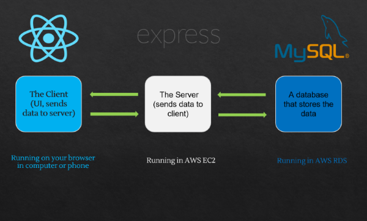
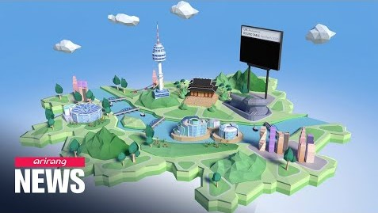
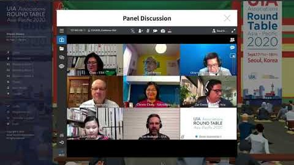
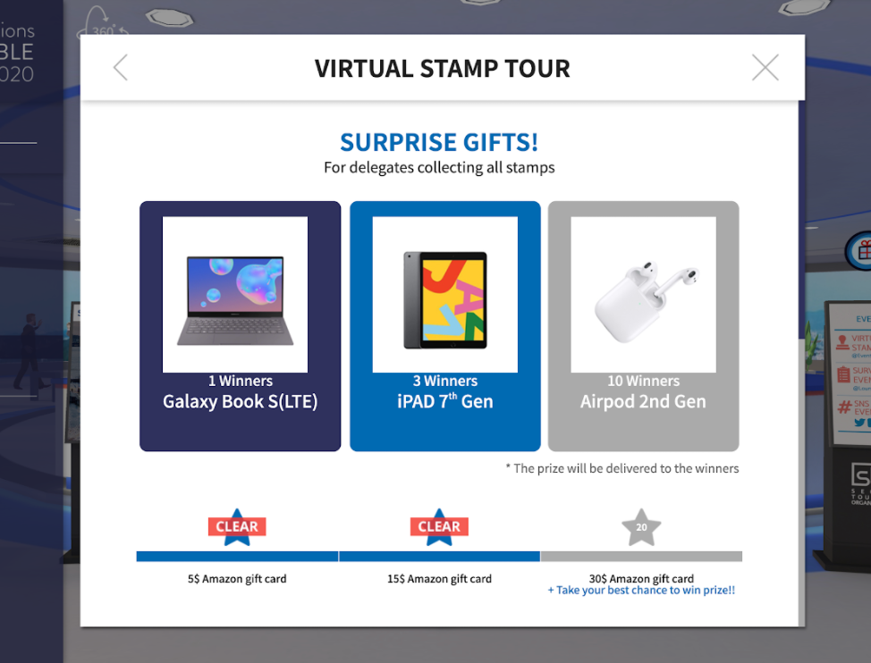
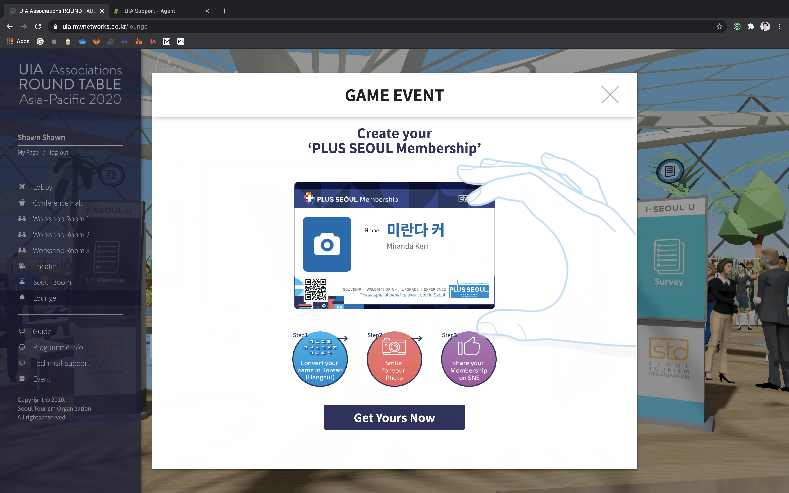
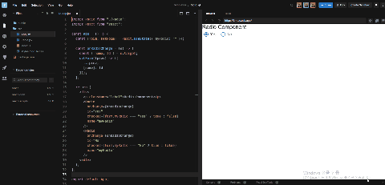
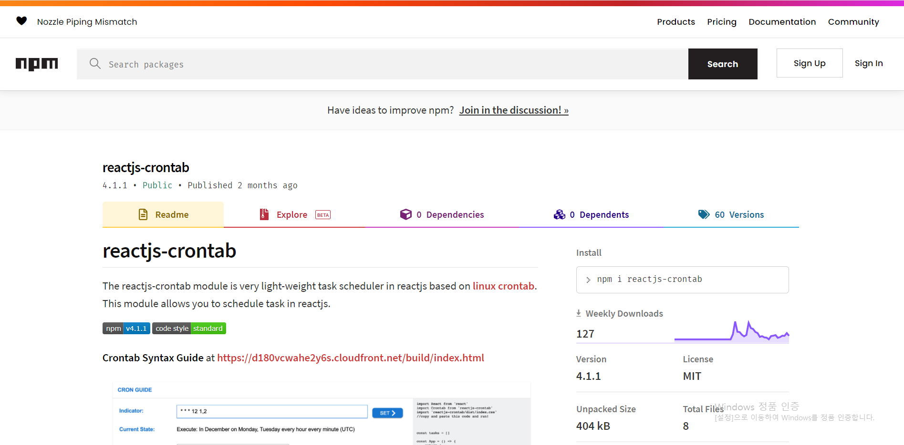

# UIA & STO Online Conference

## Table of Content

- [Role & Responsibility](#Role--Responsibility)
- [Work Flow](#Application-Work-Flow)
- [Demo](#Demo)
- [Project Description](#Project-Description)
- [Main Features](#Main-features)
- [Achievement](#Achievement)
- [Note](#note)

# Role & Responsibility

My responsibility was developing front-end and back-end. Collaborating with management, departments, and customers to identify end-user requirements and specifications. Testing and deploying applications. Troubleshooting, debugging, maintaining and improving existing software.

### My responsibilities in this project include:

- Front-end System Design
- Build RESTful APIs in Expressjs
- Create SQL statements
- User Authentication
- Create React components (tables, banners, poppers, Modals, buttons and so on)
- Schedule Push notification, VOD and Live Streaming
- Handle browser compatibility (Chrome, Safari, Firefox, MS Edge, IE11)
- Gitlab Administration
- Translation Korean to English
- Email, SMS and push notification automation
- Technical Support during the conference via live chat
- Responsive Design (Supports mobile devices)
- Data statistics
- Implement virtual event ( Stamp tour, Membership Card  ) 

A screenshot demonstrating the number of the issues in [Jira](https://www.atlassian.com/software/jira) is below

#### I solved 146 issues out of 325

# Application Work Flow

#### This application was built with Reactjs, Redux, Expressjs MysqlDB, Babylonjs and AWS.

# Demo

### News

#### This project was globally introduced by Arirang News.

[Link to the news](https://www.youtube.com/watch?v=ksBnRT1f2Ak&t=2s)

### Website URL

#### [Link to the website](http://virtualseoul.or.kr/)

While we always allow access to this website, we have closed most of its features since it is not the period of the Event.

### Recording

- [Seoul Map](https://www.youtube.com/watch?v=6EdqKznxncA)
- [LIVE Streaming demo](https://www.youtube.com/watch?v=a9wX4MSkSyg)
- [Video Chat](https://www.youtube.com/watch?v=edzgNn5f5yQ)

# Project Description

This web application was used for the Online Conference held by [Union of International Associations(UIA)](https://uia.org/) and [Seoul Tourism Organization(STO)](http://www.sto.or.kr/english/index).

- Development period: 2020.06 ~ 2020.09
- Maintenance period: 2020.09 ~ 2021.04
- Logged users per day: 3,000 ~ 5,000
- Accessed in: 26 countries
- Accessed by: Desktop, Mobile device, Labtop, Tablet
- Accessed on: Chrome, IE, Firefox, Safari, Edge

## Main features

### Video chat

### Stamp Event

### 3D Virtual Seoul tour

### Live And VOD Streaming

### Seoul Membership Card Event

### This application feels like a real event and offers almost all features that offline events do.

# Achievement

### 1. This project has brought over 10 additional contracts.

#### [Reference] - Some of the biggest projects I've built are listed below.

- [KHA Online Conference](https://khc2020.salin.co.kr) ( Korean Hospital Association ) can be logged in with ID: host01@salin.co.kr PW: 1234
- [Simens Online Conference](https://siemens-evavconference.govent.io) can be logged in with ID: abc@abc.com PW: 1234
- Asia TEFL Online Conference (Teaching English as a second or foreign language)

### 2. Created reusable components and APIs.

During the development, we created several reusable components and APIs. This allowed us to save time and make greater profits.

#### [Reference] - Reusable radio input component on [codesandbox](https://codesandbox.io/s/radio-3mtce?file=/src/App.jsx).

### 3. This project motivated me to build a reactjs open-source library

#### [Reference] - [Link To My Crontab library](https://www.npmjs.com/package/reactjs-crontab)

I realised building a crontab (scheduling jobs) is quite tedious and difficult to test. I knew such a function will be used many times in our projects and I wouldn't want to repeat the same implementation over and over again. This motivated me to modularise this functionality. And one thing led to another, I ended up creating a node open-source package out of it. There is an average of approximately 300 weekly downloads.

### 4. Learned how to optimize React app performance.

As the application grew, it started getting too much re-render and slowed the app down. Particularly, I was surprised when HTML auto-canvasing functionality no longer worked after adding several logics to it. In the debugging and optimizing process, I learned about several methods such as React.memo, HOC, React.useCallback, lazyload, algorithms and so on.    

# Note 

Due to the company policy, I am unable to open the source code.
