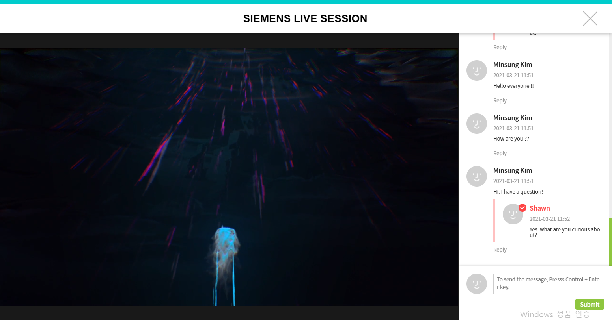

# STO & UIA Online Conference & Exhibition

## Table of Content

- [Demo](#Demo)
- [Project Description](#Project-Description)
- [Work Flow](#Application-Work-Flow)
- [Features](#Features)
- [Job Description](#Job-Description)
- [Result of project](#Result-of-project)
- [Note](#note)

# Demo

#### This project was globally introduced by Arirang News.

[Link to the news](https://www.youtube.com/watch?v=ksBnRT1f2Ak&t=2s)

#### I also recorded this during the Event

- [Demo 1](https://www.youtube.com/watch?v=6EdqKznxncA)
- [Demo 2](https://www.youtube.com/watch?v=a9wX4MSkSyg)
- [Demo 3](https://www.youtube.com/watch?v=edzgNn5f5yQ)

# Project Description

This project was used for the Online Conference & Exhibition held by Seoul Tourism Organization(STO) and Union of International Associations(UIA). Due to the Pandemic, They couldn't host the annual event that they had been organised for decades. Therefore, they needed us to build a website, Virtual Seoul, as a substitute for their offline Conference and Exhibition.

Our team consisted of

- A Project Manager
- A front-end developer
- Two back-end developer,
- Two Web designer
- Two WebGL developer

My responsibility was developing both front-end and back-end. Particularly, I developed the front-end entirely on my own from scratch.

# Application Work Flow

#### This application was built with Reactjs, Redux, Expressjs MysqlDB, Babylonjs and AWS.

# Features

## Video chat

## Text chat

## Stamp Event

## 3D Virtual Seoul tour

## Live And VOD Streaming

## Seoul Membership Card Event

## And much more

- Compatible with all modern browsers including IE11
- Responsive Design ( Supports mobile devices )
- Help Center ( Technical Support )
- Statistics

#### This application feels like a real event and offers almost all features that offline events do.

# Job Description

### My duties in this project include:

- Build RESTful APIs in expressjs
- CRUD data in Mysql DB Tables
- User Authentication
- Create UIs in React (tables, banners, poppers, Modals, buttons and so on)
- Help Center embedding & Technical Support during the event
- Enable user to take a photo for a gift event.
- Schedule Push notification, VOD and Live Streaming
- Handle browser compatibility (Chrome, Safari, Firefox, MS Edge, IE11)
- Responsive Design ( Supports mobile devices )
- Gitlab Administration
- Enable user to do video chat
- Enable user to do text chat
- Translation Korean to English

# Result of project

### STO is very happy with this application.

STO was very satisfied with this application. They even asked us to do more projects for them.

### This project motivated me to build a reactjs open-source library

During the development, I realised building a crontab (scheduling jobs) is quite tedious and difficult to test. This motivated me to create a node open-source package, which allows you to easily build a crontab functionality. [Link To My Crontab library](https://www.npmjs.com/package/reactjs-crontab). I created this package entirely on my own from scratch. There is an average of approximately 300 weekly downloads.

### Our application has received great attention in the market

Our application, Virtual Seoul, has received great attention in the market and attracted many professional event organizers. As a result, It brought many contracts.

#### Some of the biggest projects I've built are listed below.

- KHA ( Korean Hospital Association )
- Asia TEFL (Teaching English as a second or foreign language)
<!--

# Note

Due to the company policy, I am afraid that I am not allowed to open the source code. -->
